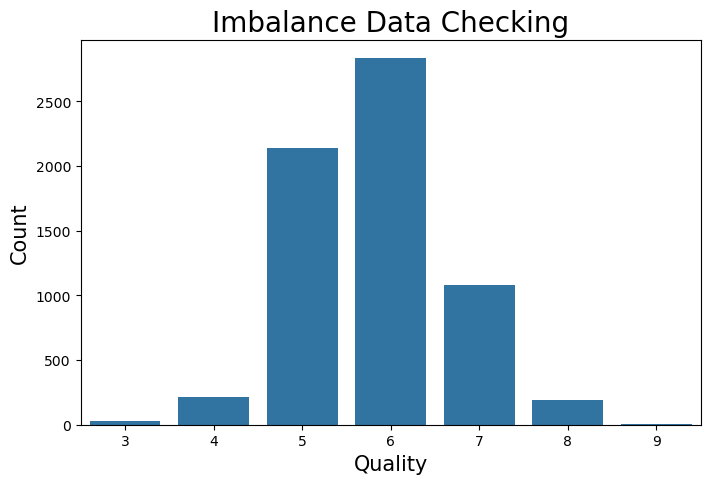

# Wine-Quality-Prediction-and-Data-Analysis-Project

# Introduction
This project explores a real-world classification problem using a dataset comprising over 1,000 samples and seven significant features. The objective is to build predictive models that can classify data into predefined categories, providing insights that are both actionable and valuable for decision-making.

The workflow begins with exploratory data analysis (EDA) to understand the dataset's structure, uncover patterns, and address challenges such as missing values or imbalances. Data preprocessing ensures the dataset is clean and ready for modeling. Various classification algorithms are applied and evaluated based on performance metrics like accuracy, precision, recall, and F1-score.

Beyond model performance, this project addresses ethical considerations, including data bias and privacy concerns, while also highlighting the business relevance of the findings. Actionable recommendations are provided to demonstrate how organizations can leverage these insights to enhance decision-making, optimize processes, and achieve strategic goals.

By the end of this project, we aim to deliver a comprehensive analysis that not only solves the classification problem but also offers meaningful guidance for real-world applications.

Objectives:
* Perform exploratory data analysis (EDA) and preprocess the dataset to ensure it is clean and suitable for classification tasks.
* Build, evaluate, and compare multiple classification models using performance metrics such as accuracy, precision, recall, and F1-score.
* Derive actionable insights from the model's outputs to support decision-making, improve processes, and address business challenges effectively

Dataset:
[Wine Quality Dataset](https://archive.ics.uci.edu/dataset/186/wine+quality)

The dataset includes information about:
* Wine chemical properties such as alcohol content, acidity, and pH level, which are key indicators of wine quality.
* Sensory attributes including characteristics like color intensity and taste profiles that impact the overall quality rating.
* Wine quality ratings assigned by experts, typically on a scale from 0 to 10, serving as the target variable for classification.
* Physical characteristics such as residual sugar, chlorides, and sulfur dioxide levels that may influence the wine’s flavor and preservation.
* Dataset size containing over 1,000 samples, ensuring a sufficient amount of data for model training and evaluation.

Implementation:
Libraries: sklearn, Matplotlib, pandas, seaborn, NumPy, Scipy, Imblearn

Exploratory Data Analysis (EDA)

1. Checking for Missing Values
First, I checked for missing values and duplicates in the dataset. It's important to handle missing data before performing any analysis or model building. Here's the  values of missing data and duplicates:
* Missing Values = 0
* Duplicates = 1,279

2.Checking for Imbalanced Dataset
Next, I checked for class imbalance in the target column. An imbalanced dataset can lead to biased models. The following chart shows the distribution of the target variable:

