# Wine Quality Prediction and Data Analysis Project

## Introduction
This project explores a real-world classification problem using a dataset comprising over 6,000 samples and eleven significant features. The objective is to build predictive models that can classify data into predefined categories, providing insights that are both actionable and valuable for decision-making.

The workflow begins with exploratory data analysis (EDA) to understand the dataset's structure, uncover patterns, and address challenges such as missing values or imbalances. Data preprocessing ensures the dataset is clean and ready for modeling. Various classification algorithms are applied and evaluated based on performance metrics like accuracy, precision, recall, and F1-score.

Beyond model performance, this project addresses ethical considerations, including data bias and privacy concerns, while also highlighting the business relevance of the findings. Actionable recommendations are provided to demonstrate how organizations can leverage these insights to enhance decision-making, optimize processes, and achieve strategic goals.

By the end of this project, we aim to deliver a comprehensive analysis that not only solves the classification problem but also offers meaningful guidance for real-world applications.

## Objectives:
* Perform exploratory data analysis (EDA) and preprocess the dataset to ensure it is clean and suitable for classification tasks.
* Build, evaluate, and compare multiple classification models using performance metrics such as accuracy, precision, recall, and F1-score.
* Derive actionable insights from the model's outputs to support decision-making, improve processes, and address business challenges effectively

## Dataset:
[Wine Quality Dataset](https://archive.ics.uci.edu/dataset/186/wine+quality)

## The dataset includes information about:
* Wine chemical properties such as alcohol content, acidity, and pH level, which are key indicators of wine quality.
* Sensory attributes including characteristics like color intensity and taste profiles that impact the overall quality rating.
* Wine quality ratings assigned by experts, typically on a scale from 0 to 10, serving as the target variable for classification.
* Physical characteristics such as residual sugar, chlorides, and sulfur dioxide levels that may influence the wine’s flavor and preservation.
* Dataset size containing over 1,000 samples, ensuring a sufficient amount of data for model training and evaluation.

## Implementation:
**Libraries:** sklearn, Matplotlib, pandas, seaborn, NumPy, Scipy, Imblearn

## Exploratory Data Analysis (EDA)

### 1. Checking for Missing Values
First, I checked for missing values and duplicates in the dataset. It's important to handle missing data before performing any analysis or model building. Here's the  values of missing data and duplicates:
* **Missing Values** = 0
* **Duplicates** = 1,279

### 2. Checking for Imbalanced Dataset
Next, I checked for class imbalance in the target column. An imbalanced dataset can lead to biased models. The following chart shows the distribution of the target variable, as they are imabalanced .We will apply SMOTE technique to solve this problem.

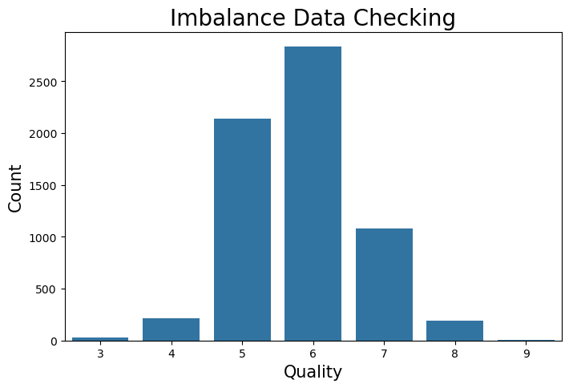

### 3. Checking for Outliers
I also checked for outliers in the dataset, as they can significantly impact the analysis. The following boxplot shows the outliers in the numeric columns:

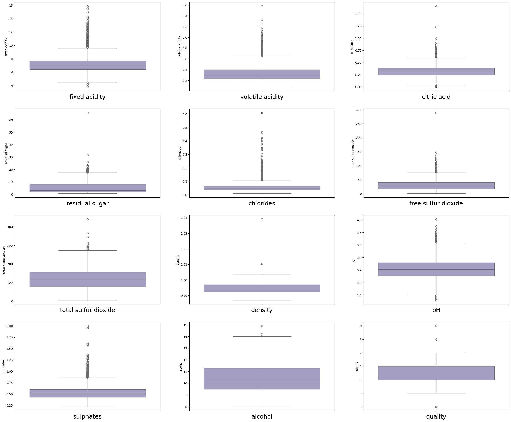

### 5. Correlation Analysis
To understand the relationships between numerical features, I checked for correlations. Here's a heatmap showing the correlation between variables:

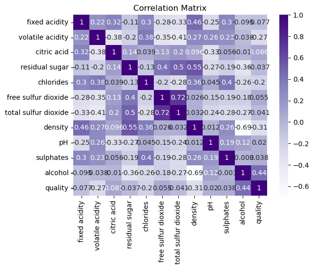

### 6. Pair Plot based on Quality 
I explored the relationships between features based on the 'quality' column. Here's the pair plot that illustrates these relationships:

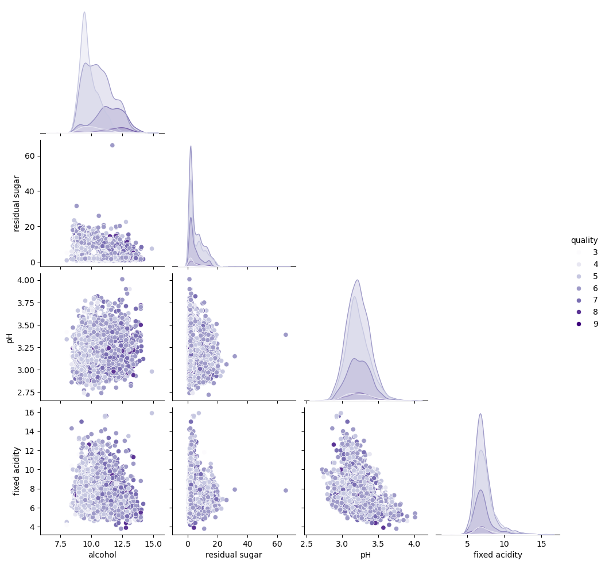  

### 7. Histograms
I plotted histograms for the numeric columns to understand their distributions:

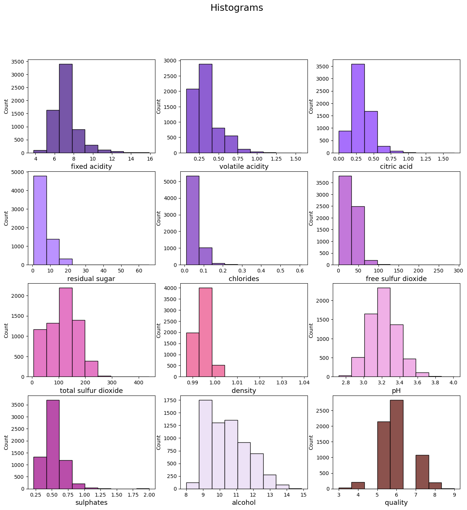  

### 8. Histplot with Quality Column
I also created a histplot for the 'quality' column to analyze its distribution:

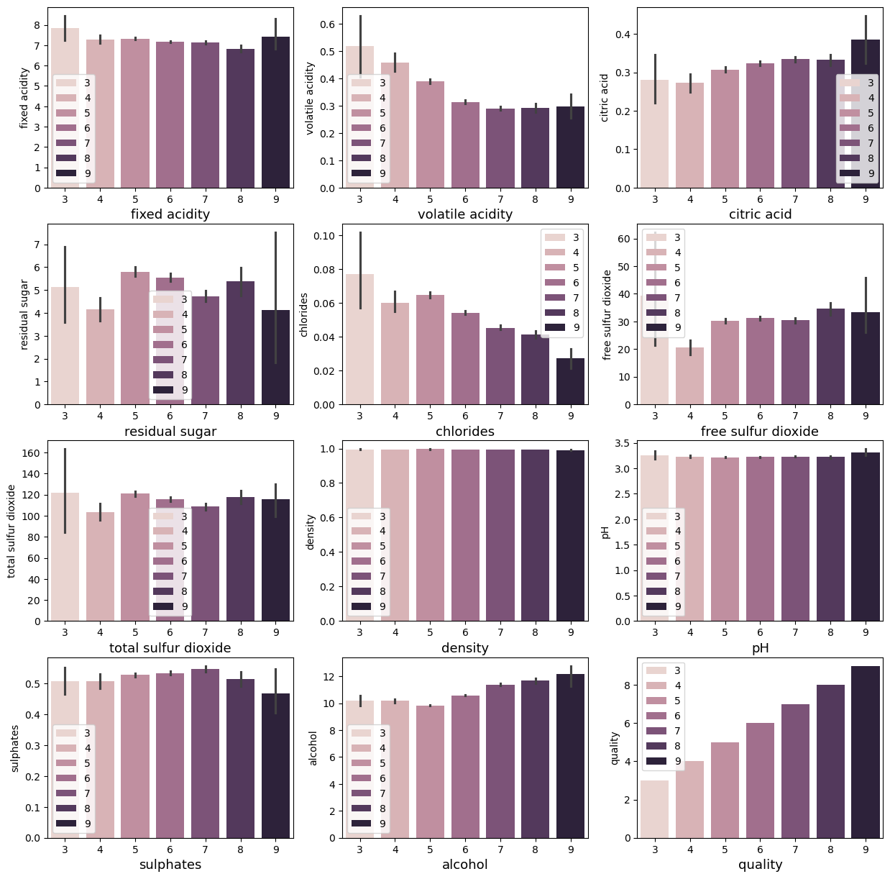  

### 9. Skewness and Kurtosis
Finally, I checked for skewness and kurtosis in the dataset. These metrics help assess the normality of the data. Some of the columns are highly positively skewed, to standerize it we will use the technique of **Log Transformation**. Here's the output for skewness and kurtosis:

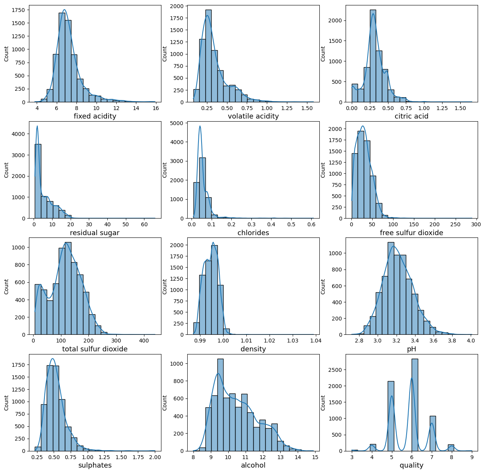 

## Data Processing ( Feature Engineering)
### 1. Outlier Removal
We have used the **IQR** method to remove outliers that we saw earlier in EDA.

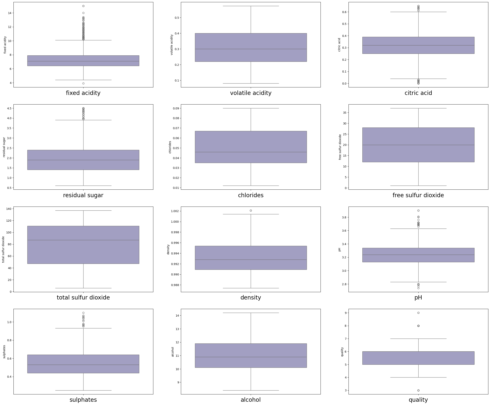  

### 2. Removing Skewness
We used the **Log Transformation** technique to remove skewness from our dataset.

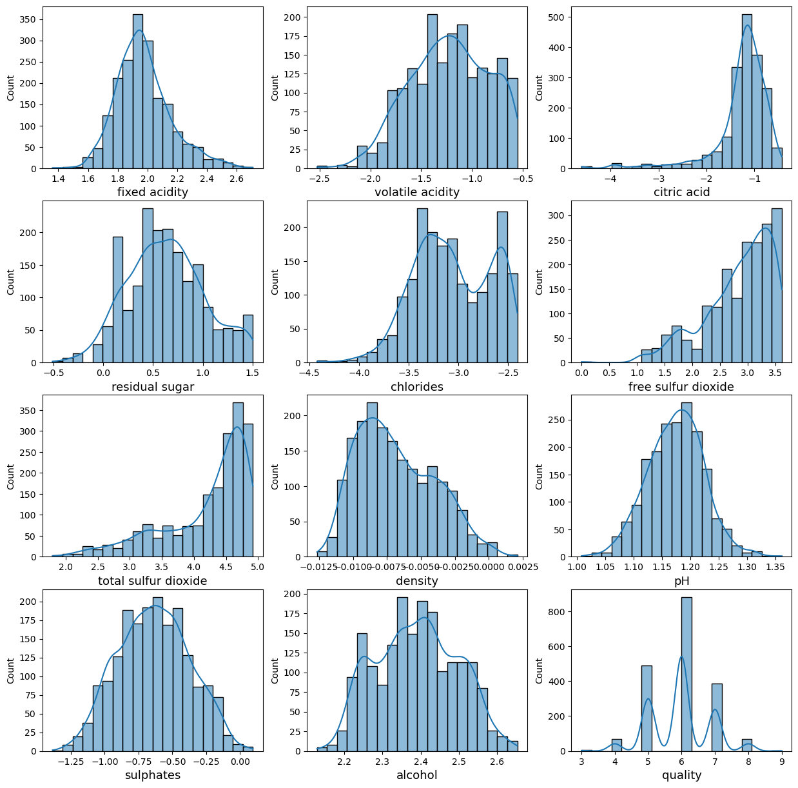 

### 3. Feature Scaling
I used Standard Scaler to standardize features by centering them around a mean of 0 and scaling to unit variance. This ensures consistency and improves the performance of machine learning models sensitive to feature scaling.

### 4. Encoding Target Values
The target values are encoded as:
* Ratings 3-4 as "Low Quality"(0)                                                                                                            
* Ratings 5-6 as "Medium Quality"(1)                                                                                                          
* Ratings 7-8 as "High Quality"(2)

### 5. Imbalance to Balanced Dataset
First we checked the division of data between the qualities:

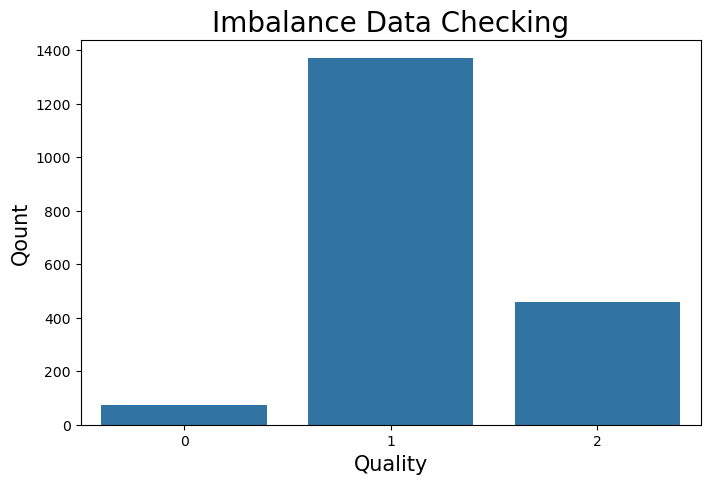 

Then we used SMOTE technique to balance them.

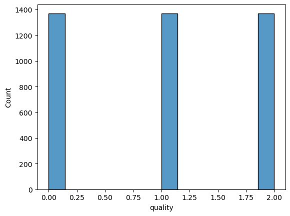 

## Model Selection and Training
**Chose several classification algorithms to evaluate:**
* Logistic Regression
* Support Vector Machine(SVM)
* Random Forest
* K-Nearest Neighbors(KNN)
* Decision Tree

### Parameters and Accuracy

To identify the best-performing model, I used **GridSearchCV** to tune hyperparameters for each algorithm. Below is a summary of the best parameters, cross-validated accuracies, and test accuracies for all the models:

| Model                  | Best Parameters                                                | Cross-Validated Accuracy | Test Accuracy |
|------------------------|---------------------------------------------------------------|--------------------------|---------------|
| Logistic Regression    | {'C': 21.544, 'solver': 'liblinear'}                          | 0.6868                   | 0.6837        |
| **SVM**                | **{'C': 100, 'kernel': 'rbf'}**                               | **0.8898**               | **0.9140**    |
| K-Nearest Neighbors    | {'n_neighbors': 1, 'weights': 'uniform'}                      | 0.8902                   | 0.8832        |
| **Random Forest**      | **{'max_depth': None, 'min_samples_split': 2, 'n_estimators': 100}** | **0.8940**               | **0.9011**    |
| Decision Tree          | {'criterion': 'entropy', 'max_depth': None, 'min_samples_split': 2} | 0.8290                   | 0.8232        |

### Selected Model
Based on Test Accuracy and Consistency across performance metrics, **Support Vector Machine(91.40%)** and **Random Forest(90.11%)** were the top performers. Either model could be selected, depending on the computational resources available , as **SVM** is more computationally intensive at prediction time, especially on large datasets. 

### Summary
Both **Random Forest** and **Support Vector Machine** show high accuracy, precision, and recall across all quality classes, making them ideal choices for this classification task. **KNN** is also a strong secondary model that offers good interpretability when clear decision boundaries are preferred.

### Business Insight
The high performance of **Random Forest** and **SVM** in both high and low-quality predictions suggests they could be leveraged for business decisions like **customer segmentation** and **quality control** in production.

### Key Performance Metrics Justification
**The metrics used to evaluate the models are:**

**Accuracy**: Measures overall correctness across all classes, useful for balanced datasets.
**Precision**: Ensures fewer false positives, crucial for minimizing incorrectly labeling lower-quality wine as higher quality.
**Recall**: Ensures few instances of each class are missed, especially for high-quality wines.
**F1-Score**: Balances precision and recall, providing a consolidated view of performance.
**Confusion Matrix**: Highlights areas where the model confuses classes, offering insights into model strengths and weaknesses.

### Results for Random Forest and Support Vector Machine
#### Random Forest
* **Test Accuracy:** 91.11%
* **Precision, Recall, and F1 Score:**
  * **Low Quality (Class 0):** Precision: 0.94, Recall: 0.98, F1-Score: 0.96
  * **Medium Quality (Class 1):** Precision: 0.90, Recall: 0.80, F1-Score: 0.85
  * **High Quality (Class 2):** Precision: 0.87, Recall: 0.93, F1-Score: 0.90
* **Confusion Matrix:**

  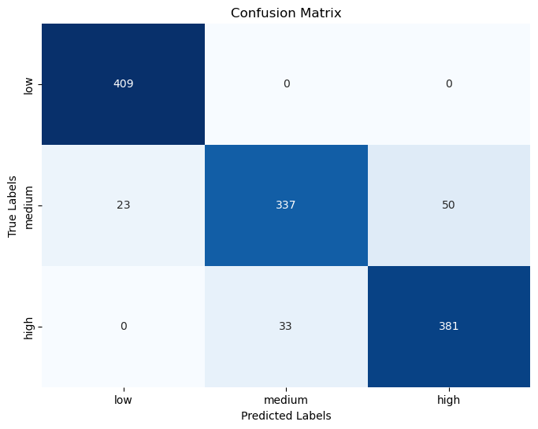 
* **Interpretation:** Random Forest performs well across all classes, especially for low and high-quality wines, with high precision and recall. It manages class boundaries effectively, with minimal misclassification.
* #### Support Vector Machine (SVM)
**Test Accuracy**: 91.50%
**Precision, Recall, and F1 Score:**
**Low Quality (Class 0)**: Precision: 0.95, Recall: 1.00, F1-Score: 0.97
**Medium Quality (Class 1)**: Precision: 0.91, Recall: 0.82, F1-Score: 0.86
**High Quality (Class 2)**: Precision: 0.88, Recall: 0.92, F1-Score: 0.90
**Confusion Matrix:**

 
* **Interpretation: SVM** achieves slightly higher accuracy and excels in classifying low and high-quality wines, with nearly perfect precision and recall for these categories. However, there is some challenge in differentiating medium-quality wines from others, leading to lower recall for this class.

### Comparative Analysis

| **Metric**             | **Random Forest**    | **Support Vector Machine** |
|------------------------|----------------------|----------------------------|
| **Test Accuracy**       | 91.11%               | 91.50%                     |
| **Precision**           | 0.90 (average)       | 0.91 (average)             |
| **Recall**              | 0.90 (average)       | 0.91 (average)             |
| **F1-Score**            | 0.90 (average)       | 0.91 (average)             |
| **Strengths**           | Robust, Adaptable    | High Accuracy, Good Recall |
| **Weaknesses**          | High computational cost | Sensitive to imbalanced classes |

**Performance Comparison**: Both models show excellent performance. **SVM** slightly outperforms **Random Forest** in accuracy, but it comes at the cost of higher computational intensity and some misclassification in the medium-quality category. **Random Forest**, however, remains strong in terms of robustness, interpretability, and consistent performance across class boundaries.

### Metric Justification

* **Precision**: Minimizes false positives, which is important for ensuring quality classification (e.g., high-quality wines should not be misclassified as low-quality).
* **Recall**: Ensures that few instances from each class, especially high-quality wines, are missed.
* These metrics balance the need for accurate and reliable classification without misestimating or overestimating any class.

### Final Recommendation

**Support Vector Machine (SVM)** is recommended due to its slightly higher accuracy (91.50%) and strong performance in identifying low and high-quality wines. However, **Random Forest** is an excellent alternative if interpretability and consistent performance across different class boundaries are prioritized.

**Summary**:  
Both models demonstrate high precision and recall across classes, making them ideal choices for this classification task. The choice between them can depend on computational resources and the specific requirements of the business, such as interpretability or speed at prediction time.

  

